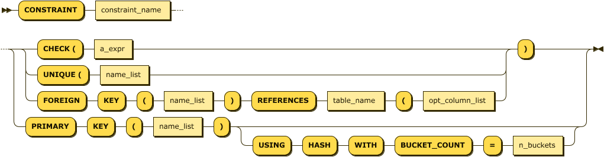
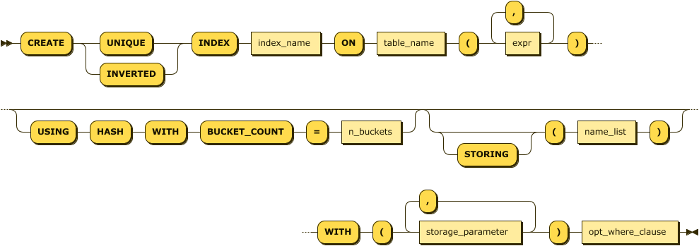
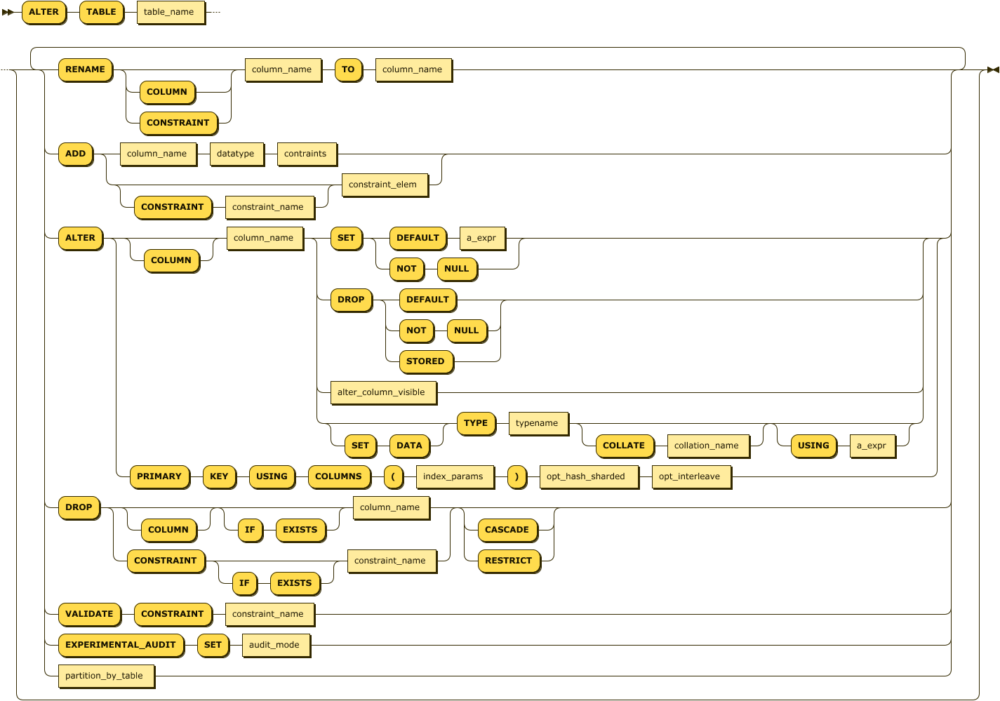
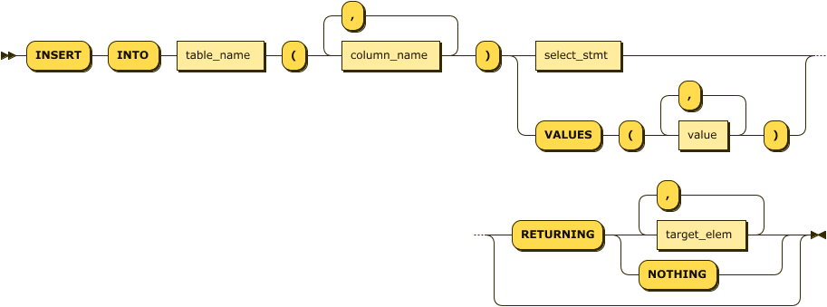

[[Ch04 – CockroachDB SQL]]

== CockroachDB SQL

The language of CockroachDB is SQL.  While there are some command line utilities, all interaction between an application and the database are mediated by SQL language commands. 

SQL is a rich language with a long history – we touched upon some of that history in Chapter 1.  A full definition of all SQL language features would require a book in its own right, and would be almost instantly out of date, since the SQL language evolves with each release.  

Therefore, this chapter aims to provide you with a broad overview of the SQL language used in CockroachDB without attempting to be a complete reference.   We’ll take a task oriented approach to the SQL language, covering the most common SQL language tasks with particular reference to unique features of the CockroachDB SQL implementation. 

A complete reference for the CockroachDB SQL language can be found in the CockroachDB documentation set .  A broader review of the SQL language can be found in the OReilly book “SQL in a Nutshell”.  book “SQL in a Nutshell”. 

We’ll mainly use the MOVR sample dataset in this chapter to illustrate various SQL language features.  We learned how to install sample data in Chapter 2; to recap, we create the MOVR database by issuing the command + cockroach workload init movr+ command:

[source, bash]
----
$ cockroach workload init movr
I210510 01:31:40.067523 1 workload/workloadsql/dataload.go:146  [-] 1  imported users (0s, 50 rows)
I210510 01:31:40.084391 1 workload/workloadsql/dataload.go:146  [-] 2  imported vehicles (0s, 15 rows)
I210510 01:31:40.186933 1 workload/workloadsql/dataload.go:146  [-] 3  imported rides (0s, 500 rows)
I210510 01:31:40.269703 1 workload/workloadsql/dataload.go:146  [-] 4  imported vehicle_location_histories (0s, 1000 row
s)
I210510 01:31:40.355601 1 workload/workloadsql/dataload.go:146  [-] 5  imported promo_codes (0s, 1000 rows)
I210510 01:31:40.372375 1 workload/workloadsql/workloadsql.go:113  [-] 6  starting 8 splits
I210510 01:31:40.489789 1 workload/workloadsql/workloadsql.go:113  [-] 7  starting 8 splits
I210510 01:31:40.587835 1 workload/workloadsql/workloadsql.go:113  [-] 8  starting 8 splits
----

SQL LANGUAGE COMPATIBILITY

CockroachDB is broadly compatible with the PostgreSQL implementation of the SQL:2003 standard.  The SQL:2003 standard contains a number of independent modules and no major database implements all of the standard.  

CockroachDB varies from PostgreSQL  in a couple of areas:

•	CockroachDB does not currently support stored procedures, events or triggers.  In PostgreSQL, these stored procedures allow for the execution of program logic within the database server, either on-demand or in response to some triggering event.  
•	CockroachDB does not currently support User Defined Functions
•	CockorachDB does not support PostgreSQL XML functions.
•	CockroachDB does not support PostgreSQL FullText indexes and functions. 
CockroachDB supports most of the PostgreSQL datatypes, however, CockroachDB generally does not distinguish between various scalar datatypes with different precision.  For instance, in PostgreSQL, the datatypes smallint, integer, bigint and so on all have distinctly different storage within the database.  In CockroachDB these types are all synonums for the INT type which can store up to a 64bit number. 
=== CREATING TABLES AND INDEXES

==== CREATING TABLES
 In a relational database, data can only be added to pre-defined tables.  These tables are created by the +CREATE TABLE+ statement.  Indexes can be created to enforce unique constraints or to provide a fast access path to the data.  Indexes can be defined within the +CREATE TABLE+ statement or by a separate +CREATE INDEX+ statement.

The structure of a database schema forms a critical constraint on database performance, and also on the maintainability and utility of the database.   We’ll discuss the key considerations for database design in Chapter 5.  For now, let’s create a few simple tables. 

A very simple +CREATE TABLE+ is shown below.  It creates a table +mytable+ with a single column +mycolumn+.  The +mycolumn+ column can store only integer values. 

[source, sql]
----
CREATE TABLE mytable 
( 
      mycolumn int
)
----

We use  CREATE TABLE to create a table within a database.  The CREATE TABLE statement must define the columns that occur within the table, and can optionally define indexes, column families , contraints, and partitions associated with the table.  For instance, the +CREATE TABLE+ statement for the +rides+ table in the +movr+ database would look something like this:

[source, sql]
----
CREATE TABLE public.rides (
	id UUID NOT NULL,
	city VARCHAR NOT NULL,
	vehicle_city VARCHAR NULL,
	rider_id UUID NULL,
	vehicle_id UUID NULL,
	start_address VARCHAR NULL,
	end_address VARCHAR NULL,
	start_time TIMESTAMP NULL,
	end_time TIMESTAMP NULL,
	revenue DECIMAL(10,2) NULL,
	CONSTRAINT "primary" PRIMARY KEY (city ASC, id ASC),
	CONSTRAINT fk_city_ref_users 
	          FOREIGN KEY (city, rider_id) 
	          REFERENCES public.users(city, id),
	CONSTRAINT fk_vehicle_city_ref_vehicles 
	           FOREIGN KEY (vehicle_city, vehicle_id) 
	           REFERENCES public.vehicles(city, id),
	INDEX rides_auto_index_fk_city_ref_users 
	      (city ASC, rider_id ASC),
	INDEX rides_auto_index_fk_vehicle_city_ref_vehicles 
          vehicle_city ASC, vehicle_id ASC),
	CONSTRAINT check_vehicle_city_city 
           CHECK (vehicle_city = city)
);
----

This +CREATE TABLE+ statement specified additional columns, their nullability, primary and foreign keys, indexes and contraints upon table values.

<<CreateTableReference>> summarizes the syntax of the +CREATE TABLE+ statement. 

 
[[CreateTableReference]] 
.Create Table Statement
image::images/CreateTableReference.png[Create Table Statement

The following clauses in <<CreateTableReference>> are relevant here:

.Create Table options
|=======
|IF NOT EXISTS	|Specifies that the command should fail silently if the table already exists.  
|column_def   		|The definition of a column.  This includes the column name, datatype, nullability.  Constraints specific to the column can also be included here, though it’s better practice to list all contraints separately.  
|Index_def      		 |Defnition of an index to be created on the table.  Same as +CREATE INDEX+ but without the leading +CREATE+ verb.
|table_contraint 	| a constraint on the table, such as PRIMARY KEY, FOREIGN KEY or CHECK.  See below for constraint syntax. 
|LIKE			|The Like statement causes a table to be created with the same definition as the referenced table name  
|=======

===== COLUMN DEFINITIONS

A column definition consists of a column name, datatype, nullability status, default value and possibly column level constraint definitions.  At a minimum, the name and datatype must be specified:

[source, sql]
----
column_name datatype 
	[DEFAULT default_value] [NOT NULL]
	[PRIMARY KEY|FOREIGN KEY REFERENCES tables(columns)]
	[CHECK check_contraint]
----

Although constraints may be specified directly against column definitions, they may also be independently listed below the column definitions.  Many practitioners prefer to list the constraints separately in this manner because it allows all contraints, including multi-column constraints, to be located together.

===== COMPUTED COLUMNS

CockroachDB allows tables to include *computed columns* that in some other databases would require a view definition.  

[source, sql]
----
column_name AS expression [STORED] 
----

For instance, this table definition has the firstName and lastName concatenated into a fullName column:

[source,sql]
----
CREATE TABLE people 
 (
     id INT PRIMARY KEY,
     firstName VARCHAR NOT NULL,
     lastName VARCHAR NOT NULL,
     dateOfBirth DATE NOT NULL,
     fullName STRING AS (CONCAT(firstName,' ',lastName) ) STORED,
    
 )
----

Computed columns cannot be context-dependent.  That is to say, the computed value must not change over time or be otherwise non-deterministic.  For instance,  the computed column would not work, since the +age+ column would be static rather than recalculated every time.  While it might be nice to stop ageing in real life, we probably want the +age+ column to increase as time goes on. 

[source, sql]
----
CREATE TABLE people 
 (
     id INT PRIMARY KEY,
     firstName VARCHAR NOT NULL,
     lastName VARCHAR NOT NULL,
     dateOfBirth timestamp NOT NULL,
     fullName STRING AS (CONCAT(firstName,' ',lastName) ) STORED,
     age int AS (now()-dateOfBirth) STORED    
 );
----

===== DATATYPES
The base CockroachDB datatypes are shown below (in table?).  See https://www.cockroachlabs.com/docs/stable/data-types.html for more details. 

.CockroachDBDatatypes
[options="header"]
|=======
|Type|Description|Example
|ARRAY|A 1-dimensional, 1-indexed, homogeneous array of any non-array data type.|{"sky","road","car"}

|BIT|A string of binary digits (bits).|B'10010101'
|BOOL|A Boolean value.|true
|BYTES|A string of binary characters.|b'\141\061\142\062\143\063'
|COLLATE|The COLLATE feature lets you sort STRING values according to language- and country-specific rules, known as collations.|'a1b2c3' COLLATE en
|DATE|A date.|DATE '2016-01-25'
|ENUM|New in v20.2: A user-defined data type comprised of a set of static values.|ENUM ('club, 'diamond', 'heart', 'spade')
|DECIMAL|An exact, fixed-point number.|1.2345
|FLOAT|A 64-bit, inexact, floating-point number.|1.2345
|INET|An IPv4 or IPv6 address.|192.168.0.1
|INT|A signed integer, up to 64 bits.|12345
|INTERVAL|A span of time.|INTERVAL '2h30m30s'
|JSONB|JSON (JavaScript Object Notation) data.|'{"first_name": "Lola", "last_name": "Dog", "location": "NYC", "online" : true, "friends" : 547}'
|SERIAL|A pseudo-type that combines an integer type with a DEFAULT expression.|148591304110702593
|STRING|A string of Unicode characters.|'a1b2c3'
|TIME
TIMETZ|TIME stores a time of day in UTC.
TIMETZ converts TIME values with a specified time zone offset from UTC.|TIME '01:23:45.123456'
TIMETZ '01:23:45.123456-5:00'
|TIMESTAMP
TIMESTAMPTZ|TIMESTAMP stores a date and time pairing in UTC.
TIMESTAMPTZ converts TIMESTAMP values with a specified time zone offset from UTC.|TIMESTAMP '2016-01-25 10:10:10'
TIMESTAMPTZ '2016-01-25 10:10:10-05:00'
|UUID|A 128-bit hexadecimal value.|7f9c24e8-3b12-4fef-91e0-56a2d5a246ec
|=======

Note that other datatype names may be aliased against these CockroachDB base types. For instance the PostgreSQL types BIGINT and SMALLINT are aliased against the CockroachDB type INT. 
===== PRIMARY KEYS

As we know, a primary key uniquely defines a row within a table.  In CockroachDB, a primary key is mandatory since all tables are distributed across the cluster based on ranges of their primary key.  If you don’t specify a primary key a key will be automatically generated for you. 

It’s common practice to define a auto-generating primary key using clauses such as AUTOINCREMENT.   The generation of primary keys in distributed databases is a significant issue, since it’s the primary key that is used to distribute data across nodes in the cluster.  We’ll discuss the options for primary key generation in the next chapter but for now, we’ll simply note that you can generate a randomized primary key values using  the +UUID+ datatype with the +gen_random_uuid()+ function as the default value:

[source,sql]
----
CREATE TABLE people (
        id UUID NOT NULL DEFAULT gen_random_uuid(),
        firstName VARCHAR NOT NULL,
    	lastName VARCHAR NOT NULL,
        dateOfBirth DATE NOT NULL
 );
----

Other options for autogenerating primary keys will be discussed in Chapter 5. 

===== CONSTRAINTS

The +CONSTRAINT+ clause specifies conditions which must be satisfied by all rows within a table.   In some circumstances, the +CONSTRAINT+ keyword may be omitted, for instance when defining a column constraint or specific constraint types such +PRIMARY KEY+ or +FOREIGN KEY+.  <<ConstraintReference>> shows the general form of a constraint definition.  

[[ConstraintReference]] 
.Contraint Statement

 

A +UNIQUE+ constraint requires that all values for the column or column_list be unique.  

+PRIMARY KEY+ implements a set of columns which must be unique and which can also be the subject of a +FOREIGN KEY+ constraint in another table.  Both +PRIMARY KEY and +UNIQUE+ constraints require the creation of an implicit index.  If desired, physical storage characteristics of the index can be specified in the +USING+.  The options of the USING INDEX clause have the same usages as in the CREATE INDEX statement. 

+NOT NULL+ indicates that the column in question may not be NULL.  This option is only available for column constraints, but the same effect can be obtained with a table +CHECK+ constraint.
CHECK defines an expression which must evaluate to true for every row in the table.
We’ll discuss best practies for creating constraints in Chapter 5. 

Sensible definition of contraints can help ensure data quality, and can provide the database with a certain degree of self-documentation.  However, some constraints have significant performance implications, we’ll discuss these implications in Chapter 5. 
I
=== INDEXES
Indexes can be created by the CREATE INDEX statement, or an INDEX definition can be included within the CREATE TABLE statement.

We talked a lot about indexes in Chapter 2, and we’ll keep discussing indexes in the schema design and performance tuning chapters.   Effective indexing is one of the most important success factors for a performance CockroachDB implementation. 

<<CreateIndexStatement>> illustrates a simplistic syntax for the CockroachDB CREATE INDEX statement. 

 

[[CreateIndexStatement]] 
.Create Index Statement

We looked at the internals of CockroachDB indexes in Chapter 2.  From a performance point of view, CockroachDB indexes behave much as indexes in other databases – providing a fast access method for locating rows with a particular set of non-primary key values.   For instance, if we simply want to locate a row name and date of birth we might create the following multi-column index:

[source, sql]
----
CREATE INDEX people_namedob_ix ON people 
 (lastName,firstName,dateOfBirth);
----

If we furthermore wanted to ensure that no two rows could have the same value for name and date of birth we might create a unique index:

[source,sql]
----

CREATE UNIQUE INDEX people_namedob_ix ON people 
 (lastName,firstName,dateOfBirth);
----

The +STORING+ clause allows us to store additional data in the index which can allow us to satisfy queries using the index alone.  For instance, this index can satisfy queries that retrieve  phone numbers for a given name and date of birth: 

[source, sql]
----
CREATE UNIQUE INDEX people_namedob_ix ON people 
 (lastName,firstName,dateOfBirth) STORING (phoneNumber);
----

==== INVERTED INDEXES

An inverted index can be used to index the elements within an array, or the attributes within a JSON document.  We looked at the internals of inverted indexes in Chapter 2.  

For example, suppose our +people+ table used a JSON document to store the attributes for a person: 

[source,sql]
----
CREATE TABLE people 
 ( id UUID NOT NULL DEFAULT gen_random_uuid(), 
   personData JSONB );

INSERT INTO people (personData)
VALUES('{
		"firstName":"Guy",
        "lastName":"Harrison",
        "dob":"21-Jun-1960",
        "phone":"0419533988",
        "photo":"eyJhbGciOiJIUzI1NiIsI..."
     }');
----

We might create an inverted index as follows:

[source,sql]
----
CREATE INVERTED INDEX people_inv_idx ON
people(personData);
----

Which would support queries into the JSON document such as this:

[source,sql]
----
SELECT *
FROM people
WHERE personData @> '{"phone":"0419533988"}';
----

However, inverted indexes index every attribute in the JSON document, not just those that you want to search on.  Therefore, you might find it more useful to create a calculated column on the JSON attribute and then index on that computed column:  

[source, sql]
----
ALTER TABLE people ADD phone STRING AS (personData->>'phone') STORED;

CREATE INDEX people_phone_idx ON people(phone);
----

==== HASH SHARDED INDEXES

If you are working with a table that must be indexed on sequential keys, you should use hash-sharded indexes. Hash-sharded indexes distribute sequential traffic uniformly across ranges, eliminating single-range hotspots and improving write performance on sequentially-keyed indexes at a small cost to read performance

[source,sql]
----
CREATE TABLE people 
( id INT PRIMARY KEY, 
  firstName VARCHAR NOT NULL, 
  lastName VARCHAR NOT NULL, 
  dateOfBirth timestamp NOT NULL, 
  phoneNumber VARCHAR NOT NULL,
  serialNo SERIAL ,
  INDEX serialNo_idx (serialNo) USING HASH WITH BUCKET_COUNT=4);
----
==== INDEXED COLUMN SORT ORDER 
=== CREATE TABLE AS SELECT

The +AS select+ clause of +CREATE TABLE+ allows us to create a new table which has the data and attributes of a SQL SELECT statement.   Columns, contraints and indexes can be specified as for an existing table, but must align with the data types and number of columns returned by the SELECT statement.   For instance, here we create a table based on a join and aggregate of two tables in the MOVR database: 

[source, sql]
----
CREATE TABLE user_ride_counts AS
SELECT u.name, COUNT(u.name) AS rides 
  FROM "users" AS u JOIN "rides" AS r 
    ON (u.id=r.rider_id)
 GROUP BY u.name
----

=== CREATE TABLE LIKE
=== ALTERING  TABLES

The +ALTER TABLE+ statement allows table columns or contraints to be added, modified renamed or removed, as well as allowing for constraint validation and partitioning.   <<AlterTable>> shows the syntax 

[[AlterTable]] 
.Alter Table Statement

 

Altering table structures online is not something to be undertaken lightly, although CockroachDB provides a highly advanced mechanisms for propagating such changes without impacting availability and with minimal impact on performancefootnote:[See https://www.cockroachlabs.com/docs/stable/online-schema-changes]
DROPPING TABLES

INSERTING DATA
We can load data into a new table using the +CREATE TABLE AS select+ statement discussed earlier, using the +INSERT+ statement inside a program or from the command line shell, or by loading external data using the +IMPORT+ statement.  There are also non-SQL utilities that insert data – we’ll look at these in Chapter 7. 
THE INSERT STATEMENT 
The venerable +INSERT+ statement adds data to an existing table.   <<InsertStatement>> illustrates a simplified syntax for the +INSERT+ statement. 
 
[[InsertStatement]] 
.Insert Statement

 

+INSERT+ takes either a set of values or a select statement.  For instance, in the following example we insert a single row into the +people+ table:

[source, sql]
----
INSERT INTO people (firstName, lastName, dateOfBirth)
VALUES('Guy', 'Harrison', '21-JUN-1960');
----

The VALUES clause of the +INSERT+ statement can accept array values, inserting more than one row in a single example.  For instance, in this NodeJS example, we insert the values of an array variable into a table:

A +SELECT+ statement can be specified as the source of the inserted data:

[source, sql]
----
INSERT INTO people (firstName, lastName, dateOfBirth)
SELECT firstName, lastName, dateOfBirth
  FROM peopleStagingData;
----

RETURNING CLAUSE
ON CONFLICT
DISTINCT ON
IMPORT/IMPORT INTO

The IMPORT statement imports the following types of data into CockroachDB:

•	Avro
•	CSV/TSV
•	Postgres dump files
•	MySQL dump files
•	CockroachDB dump files

IMPORT creates a new table, while +IMPORT INTO+ allows an import into an existing table. 

The files to be imported should exist either in a cloud storage bucket – Google Cloud Storage, Amazon S3 or Azure Blob storage – from a HTTP address or from the local filesystem (“nodelocal”). 

We’ll discuss the various options for loading data into CockroachDB in Chapter 7.  However, for now, let’s create a new table +CUSTOMERS+ from a CSV file: 

[source, sql]
----
root@localhost:26257/defaultdb> IMPORT TABLE customers (
        id INT PRIMARY KEY,
        name STRING,
        INDEX name_idx (name)
)
CSV DATA ('nodelocal://1/customers.csv');
        job_id       |  status   | fraction_completed | rows | index_entries | bytes
---------------------+-----------+--------------------+------+---------------+--------
  659162639684534273 | succeeded |                  1 |    1 |             1 |    47
(1 row)

Time: 934ms total (execution 933ms / network 1ms)
----

For a single node demo cluster, the +nodelocal+ location will be somewhat dependent on your installation, but will often be in an +extern+ directory beneath the CockroachDB installation directory. 
MODIFYING DATA WITH UPDATE

The +UPDATE+ statement changes existing data in a table.   
<<UpdateStatement>> shows a simplified syntax for the +UPDATE+ statement. 

[[UpdateStatement]] 
.Update Statement
image::images/UpdateStatement.png[Update Statement]

 
FROM CLAUSE
RETURNING
UPSERT
DELETE
+DELETE+ allows data to be removed from a table.  <<DeleteStatement>> shows a simplified syntax for the +DELETE+ statement. 

[[DeleteStatement]] 
.Delete Statement
image::images/DeleteStatement.png[Delete Statement]

 

Most of the time, a +DELETE+ statement accepts a +WHERE+ clause and not much else.  For instance, here we delete a single row in the +people+ table:
[source, sql]
----
DELETE FROM people 
 WHERE firstName='Guy'
   AND lastName='Harrison';
----
TRUNCATE
TRANSACTIONS
BEGIN
COMMIT/ROLLBACK
SAVEPOINTS
SELECT FOR UPDATE
AS OF SYSTEM TIME 
QUERYING DATA

The SELECT statement is the workhorse of relational query and has a complex and rich syntax.  The CockroachDB SELECT statement implements the standard features of the standard SELECT, with just a few CockroachDB-specific features. 

[[SelectStatement]] 
.Select Statement
image::images/SelectStatement.png[Delete Statement]

 
INLINE VIEWS
COMMON TABLE EXPRESSIONS
SELECT LIST EXPRESSIONS
FROM CLAUSE – INDEX SELECTION
JOINS
WHERE CLAUSE
GROUP AND HAVING
ORDERING
WINDOW FUNCTIONS
ADVANCED DDL
In the next chapter, we’ll look at some of the considerations for data modelling and schema design.  Some of the following commands are more relevant in that context.   However, let’s look at some of the more advanced commands that we can use to define data and indexing. 
SCHEMAS
SEQUENCES
CHANGE FEEDS
PARTITIONS
TYPES
ADMINISTRATIVE COMMANDS
CockroachDB supports commands to maintaine authentication of users and their authorities to perform database operations.  It also has a job scheduler that can be used to schedule backup and restore and timed Data definition changes.  Other commands support the maintenance the cluster topology 
CLUSTER MAINTANENCE
CONFIGURE ZONE
SET CLUSTER SETTING
SET LOCALITY
SHOW RANGES
SPLIT AT
SURVIVE
SCHEDULING AND BACKUPS
BACKUP
CREATE SCHEDULE FOR BACKUP
SHOW/CANCEL/PAUSE JOBS
SECURITY 
CREATE/ALTER/DROP USER
CREATE/ALTER/DROP ROLE
GENERAL ADMINISTRATION
SHOW STATISTICS 
SHOW TRACE FOR SESSION
SHOW TRANSACTIONS
SHOW/CANCEL SESSION
EXPLAIN
SUMMARY
